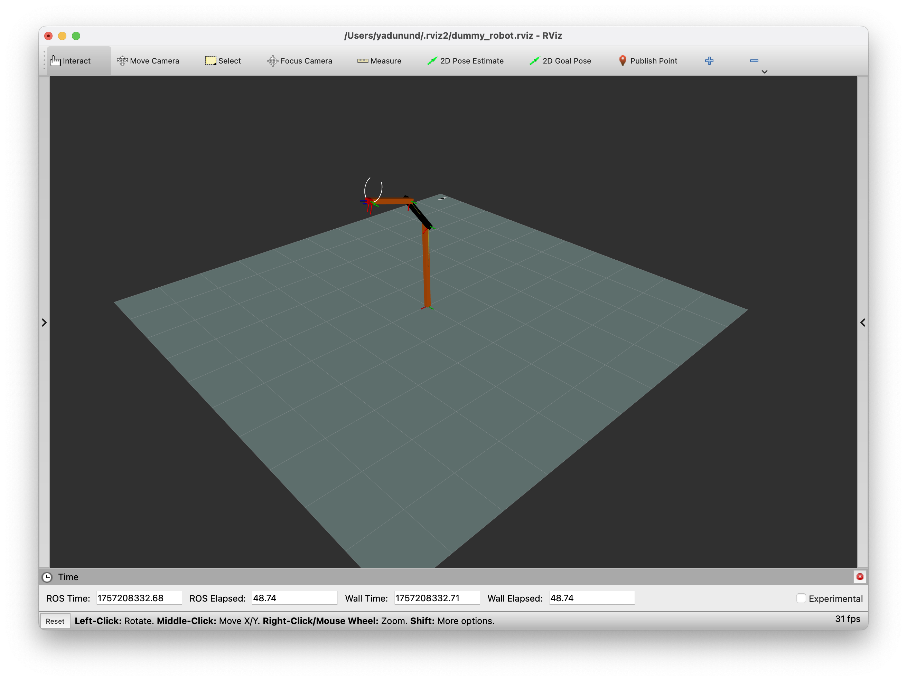

# robot_bringup



This package provides a demonstration of how to bring up a mobile manipulator using ROS 2 and `rmw_zenoh`. It includes launch files, configuration files, and instructions for visualizing the robot and tuning Zenoh for optimal performance.

## Table of Contents

- [Prerequisites](#prerequisites)
- [Bringup](#bringup)
- [Visualizing the Robot](#visualizing-the-robot)
- [Tuning Zenoh Configs](#tuning-zenoh-configs)
  - [Zenoh Configuration Files](#zenoh-configuration-files)
  - [Shared Memory](#shared-memory)
  - [Congestion Control & Priority](#congestion-control--priority)
  - [Cloud Connectivity](#cloud-connectivity)
  - [Downsampling](#downsampling)

## Prerequisites

Before you begin, ensure you have the following installed:

- ROS 2 Jazzy
- `rmw_zenoh`

## Bringup

Follow these steps to launch the mobile manipulator and its associated nodes.

1.  **Start the Zenoh router on the robot:**

    ```bash
    source /opt/ros/jazzy/setup.bash
    ros2 run rmw_zenoh_cpp rmw_zenohd
    ```

2.  **Bring up the robot nodes:**

    ```bash
    source /opt/ros/jazzy/setup.bash
    export RMW_IMPLEMENTATION=rmw_zenoh_cpp
    ros2 launch dummy_robot_bringup dummy_robot_bringup_launch.xml
    ```

3.  **Verify the topics:**

    To see the topics published by the robot, run the following command:

    ```bash
    source /opt/ros/jazzy/setup.bash
    export RMW_IMPLEMENTATION=rmw_zenoh_cpp
    ros2 topic list -v
    ```

    The output should look similar to this (standard topics are ignored for brevity):

    ```
    /joint_states [sensor_msgs/msg/JointState] 1 publisher
    /map [nav_msgs/msg/OccupancyGrid] 1 publisher
    /robot_description [std_msgs/msg/String] 1 publisher
    /scan [sensor_msgs/msg/LaserScan] 1 publisher
    /tf [tf2_msgs/msg/TFMessage] 1 publisher
    /tf_static [tf2_msgs/msg/TFMessage] 1 publisher
    ```

## Visualizing the Robot

To visualize the robot in RViz, follow these steps:

```bash
source /opt/ros/jazzy/setup.bash
cd robot_bringup
export RMW_IMPLEMENTATION=rmw_zenoh_cpp
rviz2 -d robot.rviz
```

## Tuning Zenoh Configs

This section explains how to tune Zenoh configurations for different robots and a cloud system to achieve better performance, security, and scalability.

### Zenoh Configuration Files

The configuration files can be found in the [zenoh_configs](./zenoh_configs) directory:

-   **[robot_router_config.json5](./zenoh_configs/robot_router_config.json5):** Configuration for the Zenoh router running on the robot.
-   **[robot_session_config.json5](./zenoh_configs/robot_session_config.json5):** Configuration for the Zenoh sessions (ROS 2 nodes) running on the robot.
-   **[cloud_router_config.json5](./zenoh_configs/cloud_router_config.json5):** Configuration for the Zenoh router running in the cloud.
-   **[cloud_session_config.json5](./zenoh_configs/cloud_session_config.json5):** Configuration for the Zenoh sessions (ROS 2 nodes) running in the cloud.

### Shared Memory

Enable shared memory on both the router and session configurations for the robot to improve performance.

```json5
// In robot_router_config.json5 and robot_session_config.json5
shared_memory: {
  enabled: true,
  mode: "lazy",
},
```

The default size of the shared memory is 16MB. You can adjust this by setting the `ZENOH_SHM_ALLOC_SIZE` environment variable to a multiple of 4, representing the number of bytes for the shared memory segment.

To override the Zenoh router and session configs with your custom files, follow these steps:

1.  **Start the Zenoh router with the custom config:**

    ```bash
    source /opt/ros/jazzy/setup.bash
    cd robot_bringup
    export ZENOH_ROUTER_CONFIG_URI=zenoh_configs/robot_router_config.json5
    ros2 run rmw_zenoh_cpp rmw_zenohd
    ```

2.  **Bring up the robot nodes with the custom session config:**

    ```bash
    source /opt/ros/jazzy/setup.bash
    cd robot_bringup
    export ZENOH_SESSION_CONFIG_URI=zenoh_configs/robot_session_config.json5
    export RMW_IMPLEMENTATION=rmw_zenoh_cpp
    ros2 launch dummy_robot_bringup dummy_robot_bringup_launch.xml
    ```

### Congestion Control & Priority

System load is often highest at startup, which can lead to important messages (e.g., `PointCloud`, `OccupancyGrid`) being dropped. In `rmw_zenoh`, `KEEP_ALL` and `RELIABLE` QoS settings force publishers to use reliable channels and block packages, but this can consume more resources.

A better solution is to edit the Zenoh configuration to control the dropping and priority policy for each topic. Using `blockfirst` makes congestion control more robust and fair.

The following configuration is present in [robot_router_config.json5](./zenoh_configs/robot_router_config.json5):

```json5
qos: {
  publication: [
    {
      key_exprs: ["*/map/*/*"],
      config: {
        congestion_control: "blockfirst",
        priority: "data_high",
        express: true,
        reliability: "reliable",
        allowed_destination: "remote",
      },
    },
  ],
},
```

You can start the robot nodes in the same manner as described above.

### Cloud Connectivity

For this demonstration, the cloud instance is emulated by running a Zenoh router that listens for connections on a different local port (`17447`) on the same host. Cloud sessions will connect to this port. The cloud router is also configured to connect to the robot's router.

1.  **With the robot nodes running, start a second cloud router:**

    ```bash
    source /opt/ros/jazzy/setup.bash
    cd robot_bringup
    export ZENOH_ROUTER_CONFIG_URI=zenoh_configs/cloud_router_config.json5
    ros2 run rmw_zenoh_cpp rmw_zenohd
    ```

2.  **Introspect the system:**

    ```bash
    source /opt/ros/jazzy/setup.bash
    cd robot_bringup
    export ZENOH_SESSION_CONFIG_URI=zenoh_configs/cloud_session_config.json5
    export RMW_IMPLEMENTATION=rmw_zenoh_cpp
    ros2 topic list -v
    ```

### Downsampling

When connecting robot and cloud routers, you may not want to forward all traffic over the network, as this can strain bandwidth and system load. With Zenoh, you can configure the robot's Zenoh router to apply downsampling before forwarding traffic to other routers.

This is also useful when you have multiple interfaces on the robot, each with different bandwidth restrictions. For our robot, we can apply downsampling to topics that we want to send to the cloud for visualization and logging purposes but at a lower rate.

```json5
// In robot_router_config.json5
downsampling: [
  {
    messages: ["push", "reply"],
    flows: ["egress"],
//  interfaces: [ "wlan0" ],
    rules: [
      // 1Hz for /scan topic.
      {
        key_expr: "*/scan/*/*",
        freq: 1.0
      },
      // 1Hz for /joint_states topic.
      {
        key_expr: "*/joint_states/*/*",
        freq: 1.0
      },
      // 1Hz for /tf topic.
      {
        key_expr: "*/tf/*/*",
        freq: 1.0
      },
      // 0.1Hz for /map topic.
      {
        key_expr: "*/map/*/*",
        freq: 0.1
      },
    ],
  },
],
```
Try running a second router on the same host which represents the cloud router and open an RViz session connected to this router.


```bash
source /opt/ros/jazzy/setup.bash
cd robot_bringup
export ZENOH_ROUTER_CONFIG_URI=zenoh_configs/cloud_router_config.json5
ros2 run rmw_zenoh_cpp rmw_zenohd
```

```bash
source /opt/ros/jazzy/setup.bash
cd robot_bringup
export ZENOH_SESSION_CONFIG_URI=zenoh_configs/cloud_session_config.json5
export RMW_IMPLEMENTATION=rmw_zenoh_cpp
ros2 rviz2 -d robot.rviz
```

The visualization of the robot in this "cloud" RViz session will update at a slower rate.
This is due to the robot router automatically downsampling messages of configured topics before sending it to the cloud router.

You can also measure the frequency of these topics,
```bash
source /opt/ros/jazzy/setup.bash
cd robot_bringup
export ZENOH_SESSION_CONFIG_URI=zenoh_configs/cloud_session_config.json5
export RMW_IMPLEMENTATION=rmw_zenoh_cpp
ros2 topic hz /scan
```